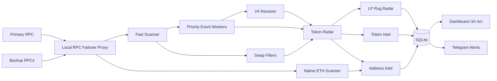

# Robinhood Chain Radar V1.3.1


**中文 | English** — Robinhood Chain mainnet (Chain ID `4663`) real-time capital-flow and token intelligence for Android/Termux and Ubuntu.

[中文完整说明](README.zh-CN.md) · [Full English README](README.en-US.md)

> **V1.3.1 — Reliability + LP Rug Radar**

> **Unofficial community project:** independent and not affiliated with, endorsed by, or sponsored by Robinhood. See [NOTICE.md](NOTICE.md).

## V1.3.1 highlights

- **Doctor:** one-command health diagnostics for RPCs, SQLite, scanner heartbeat, Dashboard, Telegram configuration and Explorer reachability.
- **Multi-RPC failover:** primary `RH_RPC_URL` + optional `RH_RPC_URLS` backups, automatic failover and primary failback.
- **Local RPC proxy:** localhost-only reliability layer at `127.0.0.1:18766`.
- **LP Rug Radar:** P0/P1 large-liquidity-removal signals with a rolling observed-flow baseline.
- **No historical alert replay:** retained V1.3.0 LP events seed state without re-sending old Telegram alerts.
- **Secret-safe RPC labels:** provider URL paths/query strings are not exposed in health output.

V1.3.0 Token Early-Capital Radar remains fully available:

**Bridge → BUY/SELL → LP → wallet intelligence → holder concentration → contract risk → P0/P1/P2 token signals.**

## What it monitors

- Robinhood Chain realtime block / Event Log scanning
- Canonical ETH / ERC20 bridge inflows
- Uniswap V2 / V3 / V4 liquidity and large swaps
- V4 `ModifyLiquidity` LP-principal estimation
- Token CA, holder count, Top1 / Top10 concentration
- 24h token BUY / SELL / LP flow and active-wallet intelligence
- Bridge → BUY → LP capital-deployment sequences
- Heuristic owner / proxy / mint / blacklist / pause / tax / trading-control risk
- P0 / P1 LP-removal risk alerts
- Bilingual Telegram alerts and local `/zh` / `/en` Dashboard


## Android / Termux

```bash
pkg update
pkg install -y git
git clone https://github.com/yinchun6969/robinhood-chain-radar.git
cd robinhood-chain-radar
bash scripts/android/install-termux.sh
```

Existing install:

```bash
cd ~/robinhood-chain-radar
git pull
bash upgrade-termux.sh
```

## Ubuntu 22.04 / 24.04

```bash
git clone https://github.com/yinchun6969/robinhood-chain-radar.git
cd robinhood-chain-radar
sudo bash scripts/ubuntu/install.sh
```

Existing install:

```bash
cd robinhood-chain-radar
git pull
sudo bash scripts/ubuntu/update.sh
```

## V1.3.1 configuration

```env
LANGUAGE=zh_CN

RH_RPC_URL=https://rpc.mainnet.chain.robinhood.com
RH_RPC_URLS=
RPC_FAILBACK_SEC=300
RPC_PROXY_PORT=18766

TOKEN_RADAR_MIN_EVENT_USD=100000
TOKEN_SIGNAL_MIN_SCORE=55
TOKEN_CORRELATION_WINDOW_MIN=180

LP_RUG_MIN_REMOVE_USD=250000
LP_RUG_ABSOLUTE_USD=1000000
LP_RUG_P0_DRAIN_PCT=50
LP_RUG_P1_DRAIN_PCT=30
LP_RUG_BASELINE_MIN_USD=500000
LP_RUG_WINDOW_HOURS=24
LP_RUG_COOLDOWN_MIN=15
```

Doctor:

```bash
.venv/bin/python doctor.py
```

Dashboard:

```text
http://127.0.0.1:8787/zh
http://127.0.0.1:8787/en
```

RPC failover health: `http://127.0.0.1:18766/health`

## Architecture



## Signal semantics

`P0 / P1 / P2` are **engineering observation priorities**, not investment recommendations.

LP Rug percentages are based on **Radar-observed large-LP net flow inside the configured rolling window**, not exact pool TVL. V4 LP USD values are principal estimates. Contract-risk output is heuristic and does not perform a real buy/sell honeypot simulation.

## Security

This is a **read-only monitoring tool**. It does not require private keys, seed phrases, Robinhood login credentials or transaction signing. Dashboard and RPC Proxy bind to localhost by default. Never commit `.env` or Telegram credentials.

## License

MIT
