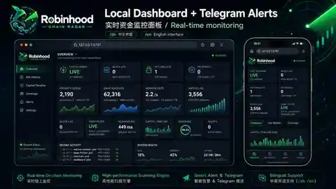

# Robinhood Chain Radar V1.3.0


**中文 | English** — Robinhood Chain mainnet (Chain ID `4663`) real-time capital-flow intelligence for Android/Termux and Ubuntu.

[中文完整说明](README.zh-CN.md) · [Full English README](README.en-US.md)

> **V1.3.0 — Token Early-Capital Radar**

> **Unofficial community project:** independent and not affiliated with, endorsed by, or sponsored by Robinhood. See [NOTICE.md](NOTICE.md).

## V1.3.0 核心升级 / Key upgrade

V1.3.0 不再只回答“发生了一笔百万美元交易”，而是把代币早期资金行为串联起来：

**跨链 Bridge → 大额 BUY/SELL → 新池/加池 LP → 热点地址 → 持有人集中度 → 合约权限风险 → P0/P1/P2 观察信号。**

V1.3.0 turns isolated alerts into a token-centric timeline:

**Bridge → large BUY/SELL → new-pool / LP deployment → wallet intelligence → holder concentration → contract-permission risk → P0/P1/P2 observation signals.**

## What it monitors

- Robinhood Chain realtime block / Event Log scanning
- Canonical ETH / ERC20 bridge inflows
- Uniswap V2 / V3 / V4 liquidity
- Uniswap V2 / V3 / V4 large swaps with BUY/SELL direction
- V4 `ModifyLiquidity` LP-principal estimation
- Address intelligence and Bridge → LP correlation
- **V1.3 Token Radar:** 24h buy/sell/net flow, LP add/remove/net, pool count, active wallets, high-score wallets
- Token CA, holder count, Top1 / Top10 concentration
- Heuristic contract source / owner / proxy / mint / blacklist / pause / tax / trading-control scan
- **Bridge → BUY → LP sequence detection**
- Priority token-analysis queue: million-dollar/new-pool/LP-removal events are analyzed first
- Non-base token/token pools track both token sides instead of silently dropping one
- **Capital score + risk score + signal score**
- Bilingual Telegram alerts and local `/zh` / `/en` Dashboard



## Android / Termux

```bash
pkg update
pkg install -y git
git clone https://github.com/yinchun6969/robinhood-chain-radar.git
cd robinhood-chain-radar
bash scripts/android/install-termux.sh
```

## Ubuntu 22.04 / 24.04

```bash
git clone https://github.com/yinchun6969/robinhood-chain-radar.git
cd robinhood-chain-radar
sudo bash scripts/ubuntu/install.sh
```

## V1.3 configuration

```env
LANGUAGE=zh_CN
ALERT_USD=1000000
INTEL_SWAP_MIN_USD=100000
TOKEN_RADAR_MIN_EVENT_USD=100000
TOKEN_SIGNAL_MIN_SCORE=55
TOKEN_CORRELATION_WINDOW_MIN=180
TOKEN_DEEP_SCAN_TTL_SEC=600
TOKEN_SIGNAL_COOLDOWN_MIN=30
```

Dashboard:

```text
http://127.0.0.1:8787/zh
http://127.0.0.1:8787/en
```

Local health endpoint: `http://127.0.0.1:8787/api/health`


## Signal semantics

`P0 / P1 / P2` are **engineering observation priorities**, not investment recommendations.

- **Capital score**: large net buys, LP deployment, new-pool activity, active/high-score wallets and Bridge → BUY → LP correlation.
- **Risk score**: holder concentration plus heuristic contract permission/source/proxy/owner checks.
- **Signal score**: capital score adjusted by risk penalty.

The contract-risk module is not a full audit and does not perform a real buy/sell honeypot simulation.

## Security

This is a **read-only monitoring tool**. It does not require:

- private keys
- seed phrases
- Robinhood login credentials
- transaction signing

Dashboard defaults to `127.0.0.1` only. Never commit `.env` or Telegram credentials.

## License

MIT
